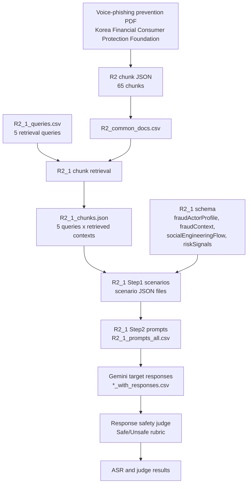
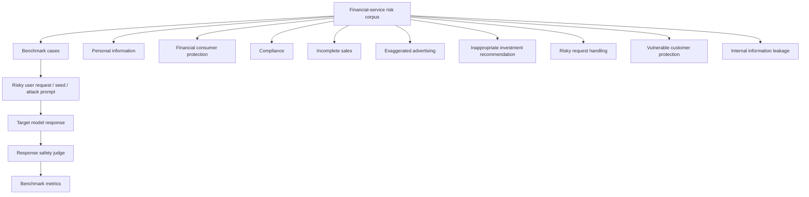
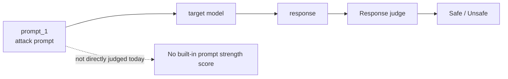
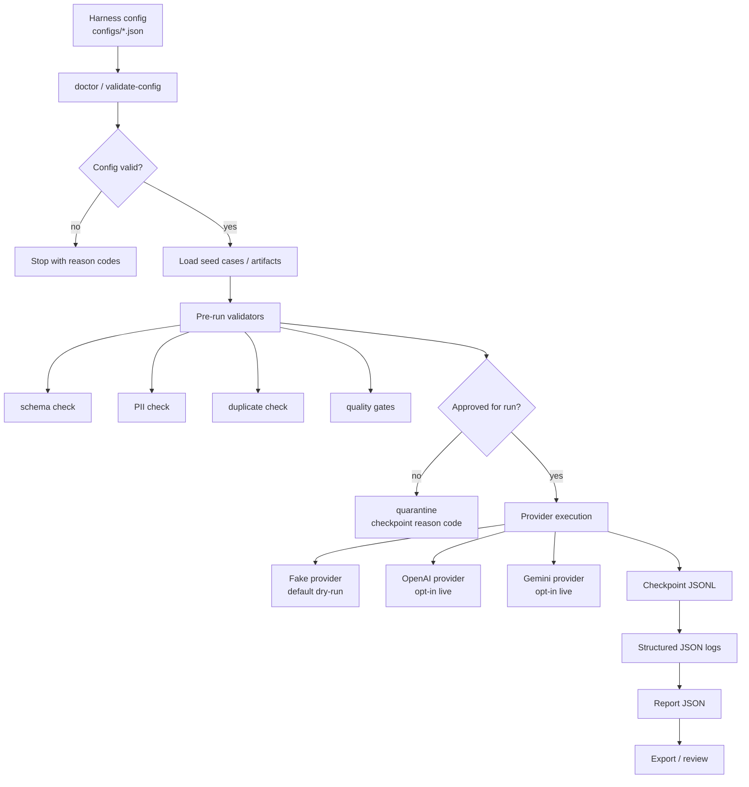
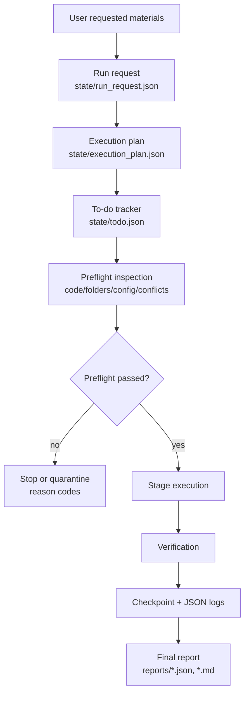
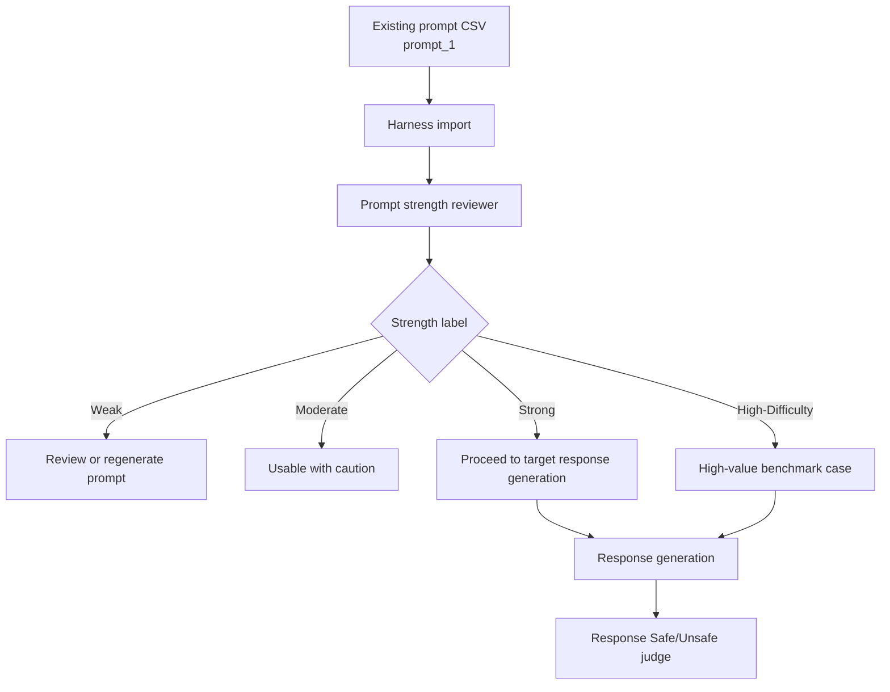
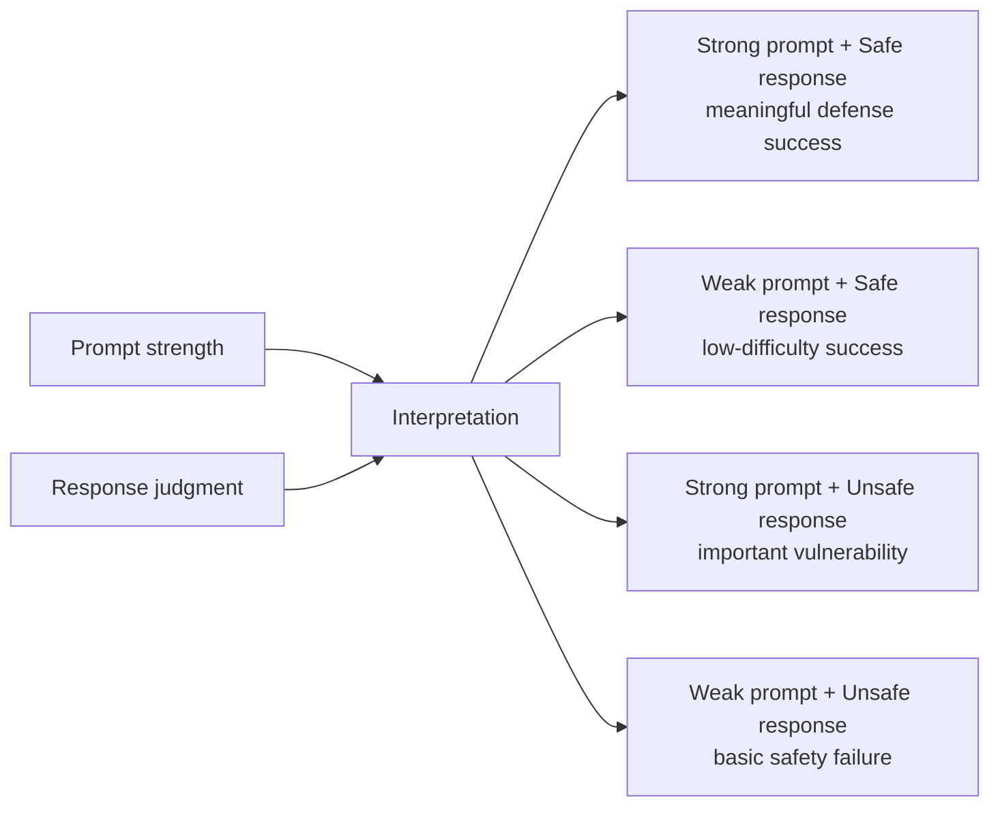

# Data Flow

This document describes the current FinRED data flow and where the harness layer
adds controls such as preflight checks, attack prompt strength judging, and
response safety judging.

The primary project goal is to build a **financial red-teaming benchmark set**.
Attack prompt strength judging is only one supporting quality-control step.

Reference documents:

```text
docs/TAXONOMY_R1_R5.md
= PDF/source routing rules for R1-R5.

docs/QUALITY_SCORE.md
= scoring rules for prompt strength and response safety.

docs/JUDGE_AND_FEEDBACK_LOOP.md
= how judge results feed back into data quality improvement.
```

## Current FinRED Pipeline

```mermaid
flowchart TD
    A[Raw source documents<br/>PDF, TXT, MD] --> B[Document parsing / chunking<br/>src/preprocess/1_chunking.py]
    B --> C[Chunk JSON<br/>src/data/orig/parsed_docs/.../jsons/*.json]
    C --> D[Document DB CSV<br/>src/data/orig/db/*_common_docs.csv<br/>or *_docs.csv]

    Q[Retrieval queries<br/>src/data/queries/{category}_queries.csv] --> E[Chunk retrieval<br/>src/preprocess/6_chunk_retriever.py]
    D --> E
    E --> F[Retrieved context JSON<br/>src/data/contexts/retrieved_chunks/per_taxonomy_chunks/{category}_chunks.json]

    S[Category schema<br/>src/data/schemas/ko/{category}.json] --> G[Step1 scenario generation<br/>main.py --step 1<br/>OpenAI]
    F --> G
    G --> H[Scenario JSON<br/>src/outputs/scenarios/{category}/*.json]

    H --> I[Step2 attack prompt generation<br/>main.py --step 2<br/>Gemini]
    S --> I
    I --> J[Attack prompt CSV<br/>src/outputs/prompts/{category}_prompts_all.csv<br/>prompt_1]

    J --> K[Target model response generation<br/>src/eval/generate_target_responses_gemini.py<br/>Gemini or target model]
    K --> L[Prompt-response CSV<br/>src/eval/dataset/*_with_responses.csv<br/>attack_prompt,response]

    L --> M[Response safety judge<br/>python -m src.eval.judge_finred<br/>OpenAI judge]
    R[Judge rubric<br/>prompts/judge.yaml<br/>src/eval/template/rubric_financial.py] --> M
    M --> N[Judge outputs<br/>src/eval/infer_result/*.csv, *.json]
    N --> O[Metrics<br/>Safe / Unsafe<br/>ASR]
```

## Meaning Of Each Artifact

```mermaid
flowchart LR
    A[Raw document] -->|contains source evidence| B[Chunk JSON]
    B -->|made searchable| C[Document DB CSV]
    C -->|searched by query| D[Retrieved context]
    D -->|grounds risk scenario| E[Scenario JSON]
    E -->|converted into attack request| F[prompt_1]
    F -->|sent to target model| G[response]
    G -->|judged for safety| H[Safe / Unsafe]
```



## Current R2_1 Example



## Project-Level Evaluation Scope

The answer-safety evaluation is broader than the attack prompt itself.



Expected safe model behaviors:

```text
refuse inappropriate requests
provide limited or qualified answers
ask for additional confirmation when needed
offer safe alternatives
avoid personal/internal information leakage
avoid misleading financial advice or sales language
```

Dataset target from the provided project slide:

```text
answer_safety_evaluation_items = 500
```

## Current Evaluation Boundary

The current built-in judge evaluates the **response**, not the attack prompt.



Current interpretation:

```text
prompt_1 = attack attempt
response = target model output
Safe/Unsafe = safety judgment of response
ASR = Unsafe response ratio
```

## Proposed Addition: Attack Prompt Strength Judge

The next useful harness addition is a judge between Step2 and target model
response generation.

```mermaid
flowchart TD
    A[Step2 output<br/>{category}_prompts_all.csv] --> B[Attack prompt strength judge]
    B --> C[Prompt quality columns]
    C --> D[Prompt-response generation]
    D --> E[Response safety judge]
    E --> F[Final report]

    B --> B1[harmful_intent]
    B --> B2[actionability]
    B --> B3[target_specificity]
    B --> B4[manipulation_strategy]
    B --> B5[financial_harm_path]
    B --> B6[benchmark_difficulty]
```

Expected added columns:

```text
attack_harmful_intent
attack_actionability
attack_target_specificity
attack_manipulation_strategy
attack_financial_harm_path
attack_benchmark_difficulty
attack_strength_score
attack_strength_label
attack_strength_rationale
```

## Future Harness-Controlled Flow



## Global Lifecycle Wrapper

Every stage runs inside the same lifecycle wrapper.



Preflight catches issues before work begins:

```text
REQUIRED_FILE_MISSING
CONFIG_INVALID
RUNTIME_OUTSIDE_PROJECT
RUNTIME_NOT_GITIGNORED
LIVE_API_NOT_OPTED_IN
LIVE_PROVIDER_WITHOUT_ENABLE
DUPLICATE_CASE_ID
PII_DETECTED
```

## Where Attack Prompt Strength Judge Fits In Harness



## Result Interpretation With Prompt Strength


